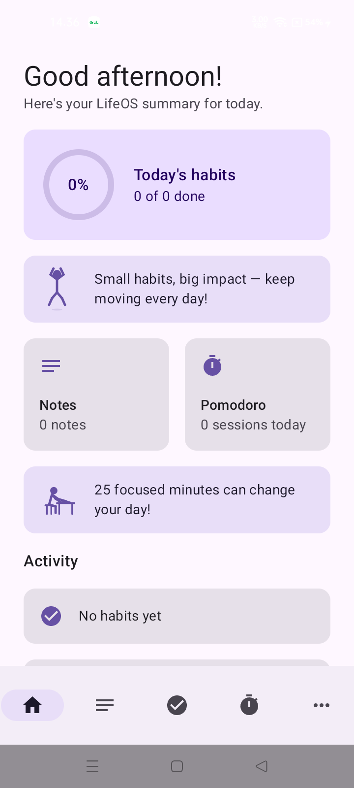
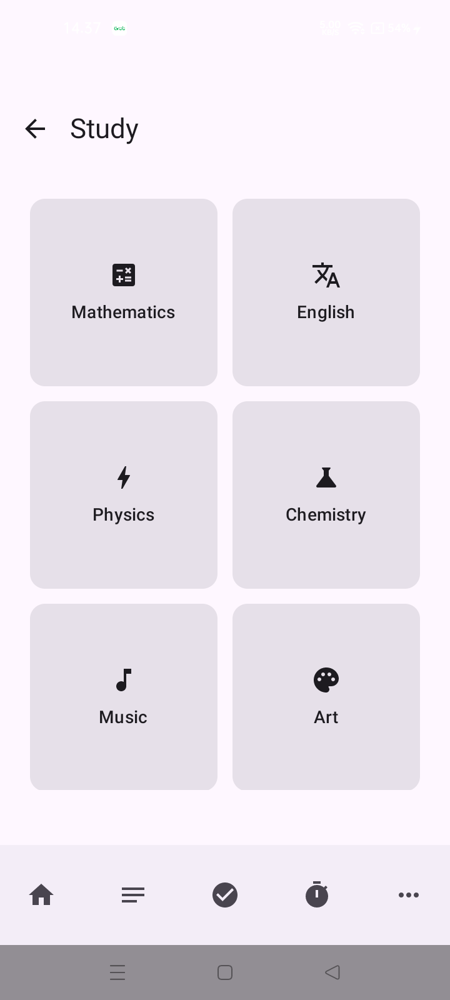
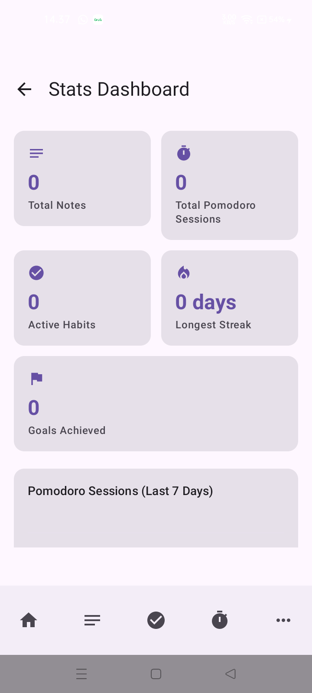
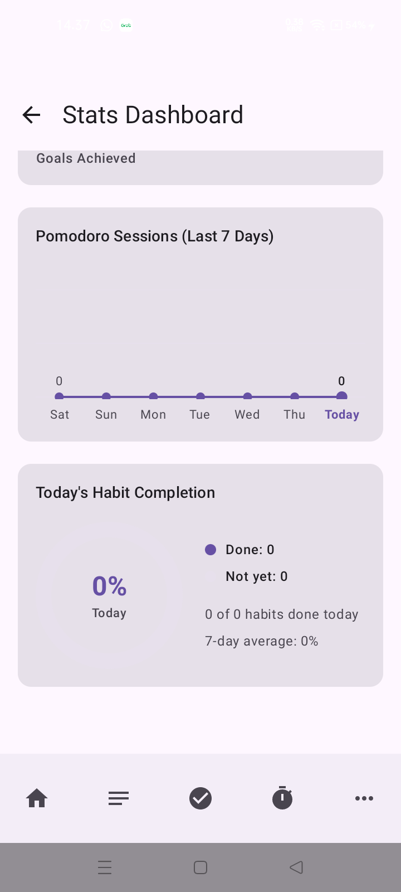

# LifeOS

A personal life-management Android app built entirely in **Kotlin + Jetpack Compose** — habits, schedule, budgeting, savings goals, notes, a Pomodoro timer, life-goal tracking, and a 31-game bilingual learning suite, all running fully offline with local-first storage.

> 📱 Android · minSdk 26 (Android 8.0+) · 100% Kotlin · 100% Jetpack Compose · Material 3

<p align="center">
  
  
  
  
</p>

## Why this project

Most portfolio Android apps are a single CRUD screen wired to a REST API. LifeOS is the opposite bet: **one cohesive app, zero backend, real depth in every module** — closer to what an experienced solo developer ships than a tutorial project. Every screen shares one Room database, one DataStore-backed settings layer, one bilingual string system, and one Material 3 theme, instead of being bolted-on feature demos.

## Modules

| Module | What it does |
|---|---|
| **Beranda** | Daily summary dashboard — habit completion ring, today's schedule, quick stats |
| **Habit Tracker** | Daily habits with streak calculation, reminders, and completion history |
| **Jadwal** | Scheduling with exact-alarm reminders (`AlarmManager`, boot-persistent) |
| **Belajar** | 31 mini-games/quizzes across 6 subjects — Math, English, Physics, Chemistry, Music, Art — sharing one reusable quiz engine |
| **Money Manager** | Income/expense tracking, per-category budgets, month-over-month insights |
| **Savings Goals** | Deposit tracking with projected time-to-target based on contribution rate |
| **Target Hidup** (Life Goals) | Long-term goal tracking with animated progress and deadlines |
| **Notes** | Text, checklist, and freehand drawing notes |
| **Pomodoro** | Focus timer with session history and haptic feedback |
| **Statistik** | Line chart (7-day Pomodoro trend) + donut chart (today's habit completion) |
| **Settings** | Theme (light/dark/system + dynamic color), language (ID/EN) |

## Engineering highlights

A few things worth a closer look if you're reviewing the code:

- **Runtime audio synthesis, zero audio assets.** Every sound effect (correct/wrong/complete/check) is a sine wave generated on the fly through `AudioTrack` — see [`core/audio/FeedbackSounds.kt`](app/src/main/java/com/example/lifeos/core/audio/FeedbackSounds.kt). No `.mp3`/`.wav` files shipped in the APK.
- **A shared quiz engine, not 18 copy-pasted screens.** [`belajar/common/QuizScreen.kt`](app/src/main/java/com/example/lifeos/ui/screens/belajar/common/QuizScreen.kt) powers 18 of the 31 learning games — one composable, animated feedback (color transitions, bounce/shake), and audio cues, reused across every subject.
- **Local-first, no backend, no tracking.** Every byte of user data lives in Room + DataStore on-device. Nothing leaves the phone — a genuine privacy story, not a marketing line.
- **A hand-rolled bilingual string system** (`core/strings/LifeOSStrings.kt`) instead of Android's XML string resources, so UI copy is typed, refactor-safe, and switchable at runtime without an activity restart.
- **R8-minified release build** verified end-to-end (~1.9 MB unsigned APK) with hand-written ProGuard rules protecting the enum-name contract that Room/DataStore persistence depends on.

## Tech stack

- **UI:** Jetpack Compose, Material 3 (dynamic color / Material You), Navigation Compose
- **Data:** Room (structured data), DataStore Preferences (settings)
- **Architecture:** `AndroidViewModel` + `StateFlow`, unidirectional data flow, no DI framework — plain constructor injection kept the codebase small and readable at this scale
- **Async:** Kotlin Coroutines & Flow throughout
- **Build:** Gradle Kotlin DSL, version catalogs (`libs.versions.toml`), KSP for Room codegen

## Project structure

```
app/src/main/java/com/example/lifeos/
├── core/           # audio synthesis, bilingual strings, theme
├── data/           # Room entities/DAOs/repositories, one per feature
├── navigation/      # NavHost + bottom nav
└── ui/screens/      # one package per module (habit, jadwal, belajar, money, ...)
```

Each feature is self-contained: its own Entity, DAO, Repository, ViewModel, and Screen — no shared "god" repository or view model.

## Building it yourself

```bash
git clone <this-repo>
cd LifeOS
./gradlew assembleDebug      # debug APK
./gradlew assembleRelease    # minified release APK (unsigned)
```

Requires JDK 17+ (Android Studio's bundled JBR works) and the Android SDK (API 36).

## Status

Actively developed as a personal project. The **Belajar** module is tagged Beta in-app while more subjects are added. An AI Assistant module exists in the codebase but is currently unwired from navigation — it was built against a Cloudflare Worker + Claude API backend that isn't deployed publicly.

## License

Personal portfolio project — not currently licensed for reuse.
